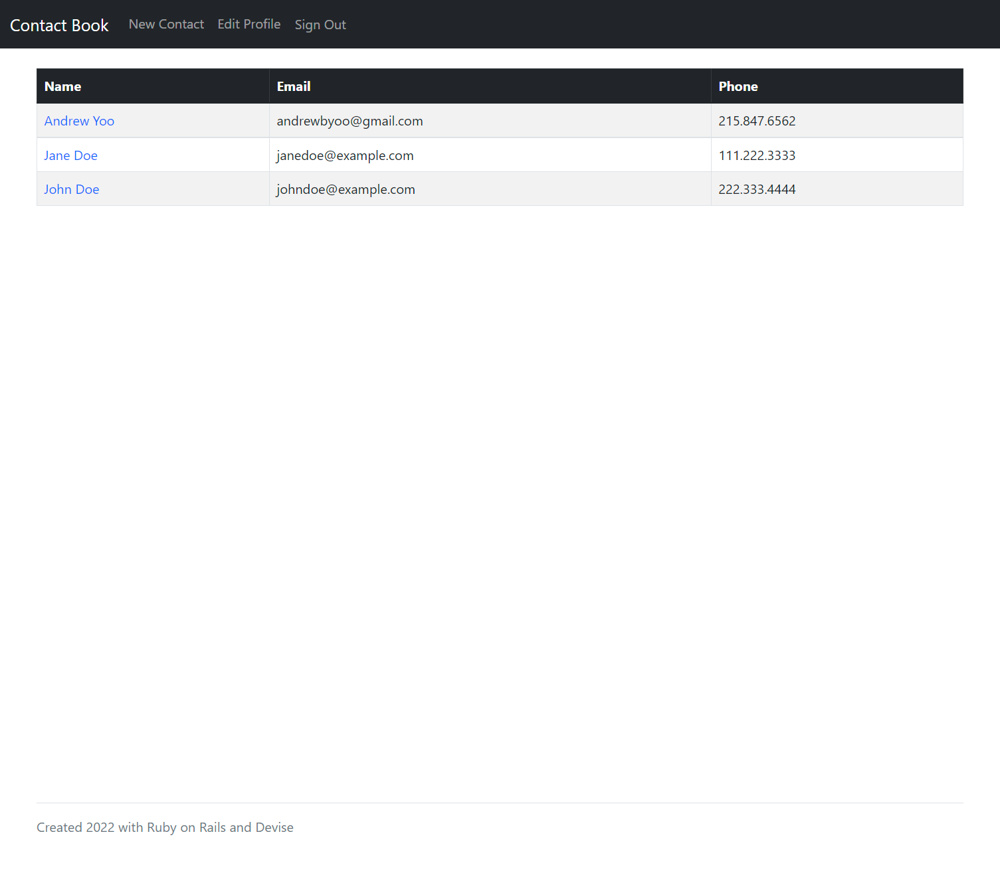

# Contact Book
[](./LICENSE)
## Description
This is a simple contact book app that lets you store, edit, and delete personal contacts. Built with Ruby on Rails and Devise.

## User Story
```
As a social person, I want a location I can keep my contacts so that, if I lose my phone, I will still have my contacts.
```

## Table of Contents
- [Installation](#installation)
- [Usage](#usage)
- [Link](#link)
- [License](#license)
- [Features](#features)
- [Questions](#questions)

## Installation
Next feature to come for setting app up as PWA.

## Usage
The visual shows the user's contacts once signed in.


## Link
Heroku link here once deployed.

## License
This application is covered under the MIT license.

## Features
- Add, edit, and delete contacts.
- Edit and delete account information.
- (Future feature) PWA.

## Questions
To view more of my projects, you can visit my GitHub page at [andrewbyoo](https://github.com/andrewbyoo).

If you have questions, email me at [andrewbyoo@gmail.com](mailto:andrewbyoo@gmail.com).
